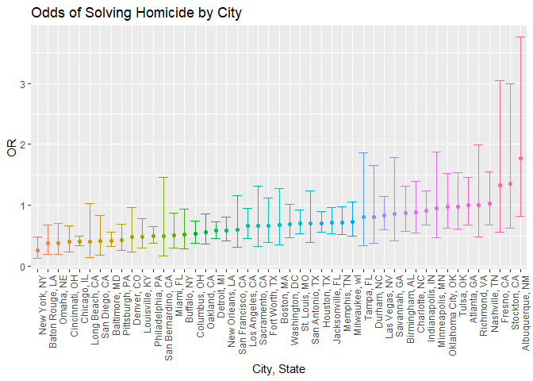

p8105_hw6_sm5134
================
Sneha Mehta
2022-11-29

## Problem 1

``` r
weather_df = 
  rnoaa::meteo_pull_monitors(
    c("USW00094728"),
    var = c("PRCP", "TMIN", "TMAX"), 
    date_min = "2017-01-01",
    date_max = "2017-12-31") %>%
  mutate(
    name = recode(id, USW00094728 = "CentralPark_NY"),
    tmin = tmin / 10,
    tmax = tmax / 10) %>%
  select(name, id, everything())
```

    ## Registered S3 method overwritten by 'hoardr':
    ##   method           from
    ##   print.cache_info httr

    ## using cached file: C:\Users\ocean\AppData\Local/Cache/R/noaa_ghcnd/USW00094728.dly

    ## date created (size, mb): 2022-09-29 10:34:22 (8.418)

    ## file min/max dates: 1869-01-01 / 2022-09-30

## Problem 2

``` r
# Prep dataset
homicide = read_csv("./homicide-data.csv") %>% 
  janitor::clean_names() %>%
  mutate(city_state = str_c(city, state, sep = ", "),
         solved = if_else(disposition == "Closed by arrest",TRUE, FALSE)) %>% 
  filter(!(city_state == "Tulsa, AL" | city_state == "Dallas, TX" | city_state == "Phoenix, AZ" | city_state == "Kansas City, MO")) %>% 
  mutate(victim_age = as.numeric(victim_age)) %>% 
  filter(victim_race == "White" | victim_race == "Black")
```

    ## Rows: 52179 Columns: 12
    ## ── Column specification ────────────────────────────────────────────────────────
    ## Delimiter: ","
    ## chr (9): uid, victim_last, victim_first, victim_race, victim_age, victim_sex...
    ## dbl (3): reported_date, lat, lon
    ## 
    ## ℹ Use `spec()` to retrieve the full column specification for this data.
    ## ℹ Specify the column types or set `show_col_types = FALSE` to quiet this message.

    ## Warning in mask$eval_all_mutate(quo): NAs introduced by coercion

``` r
# Creating dataset for Baltimore
baltimore = homicide %>% 
  filter(city == "Baltimore")

# Fitting logistic regression
fit_baltimore = 
  baltimore %>% 
  glm(solved ~ victim_age + victim_race + victim_sex, data = ., family = binomial()) 

# Cleaning fit
fit_baltimore = fit_baltimore %>% 
  broom::tidy() %>% 
  mutate(OR = exp(estimate),
         ci_lower = exp(estimate - 1.96*std.error),
         ci_upper = exp(estimate + 1.96*std.error))

# Tabulating Results
fit_baltimore %>% 
  select(term, OR, ci_lower,ci_upper, p.value) %>% 
  knitr::kable(digits = 3)
```

| term             |    OR | ci_lower | ci_upper | p.value |
|:-----------------|------:|---------:|---------:|--------:|
| (Intercept)      | 1.363 |    0.975 |    1.907 |   0.070 |
| victim_age       | 0.993 |    0.987 |    1.000 |   0.043 |
| victim_raceWhite | 2.320 |    1.648 |    3.268 |   0.000 |
| victim_sexMale   | 0.426 |    0.325 |    0.558 |   0.000 |

The odds of solving the homicide of a male victim is 0.426 times the
odds of solving the homicide of a female victim, adjusting for age and
race.

``` r
full_glm = homicide %>% 
  nest(data = -city_state) %>% 
  mutate(models = map(data, ~glm(solved ~ victim_age + victim_sex + victim_race, data = ., family = binomial())),
                       results = map(models, broom::tidy,conf.int = TRUE)) %>% 
  select(city_state, results) %>% 
  unnest(cols = results) %>% 
  mutate(OR = exp(estimate),
         ci_lower = exp(conf.low),
         ci_upper = exp(conf.high)) %>% 
  select(city_state, term, OR, ci_lower, ci_upper)

# Creating Plot
full_glm %>% 
  filter(term == "victim_sexMale") %>% 
  mutate(city_state = fct_reorder(city_state, OR)) %>% 
  ggplot(aes(x = city_state, y = OR, color = city_state)) +
  geom_point() +
  geom_errorbar(aes(ymin = ci_lower, ymax = ci_upper)) +
  labs(
    x = "City, State",
    y = "OR",
    title = "Odds of Solving Homicide by City") +
  theme(axis.text.x = element_text(angle = 90, hjust = 1)) +
  theme(legend.position = "none")
```

<!-- -->

From the plot we can see that the city with the lowest odds of solving
the homicide of a male versus a female is New York, NY and the highest
is Albuquerque, NM. Only four cities have ORs over 1: Nashville,TN;
Fresno, CA; Stockton,CA; and Albuquerque, NM. However, all of these
cities have the null value of 1 within the 95% confidence interval so we
cannot say that the OR is statistically significant.
